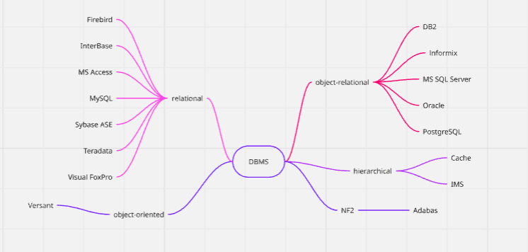
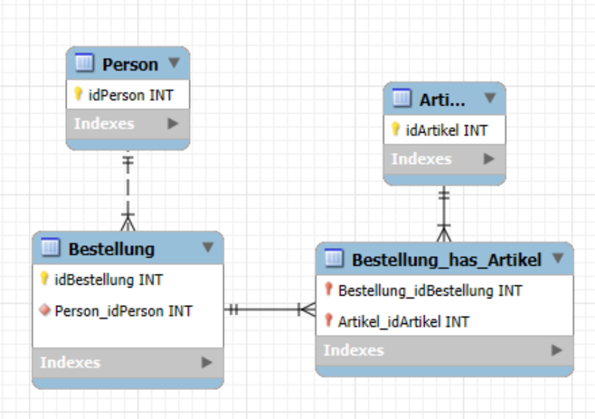

# Day 2 - 20.05.25

## Activities 
Today, we finished our installation of XAMPP and set up a database for testing purposes. After that, we were reintroduced to DBMS (Data Base Management Systems) and learned about features, (dis)dvantages and different DB-products on the market.
We also learned about Data Definition Language (DDL) and its role in creating and modifying database structures and explored character sets (Charset). Additionally, we covered the difference between identifying and non-identifying relationships in database models. Since I had some time left, I did my research on the terms partitioning and table spaces.

## Key Learnings
Today's session deepened my understanding of the technical underpinnings of databases and the tools used to manage them. A key takeaway was learning about DBMS—each platform has its strengths and weaknesses, and understanding these differences will help in selecting the right DBMS for specific applications. I also managed to get SQL-Language back into my head after a while and solved some Problems with the help of my teacher.
Even though we never worked on identifying/non-identifying relationships in M162, the concept made sense to me and I managed to correctly apply it to an exercice.

## Theory

### DBMS

Database System (DBS): Contains both DBMS and DB, relational in our case
Database Management System (DBMS): Software system that manages databases (DB) and provides an interface for users to interact with data
Key Features: data integrity (Logical element is only saved at one point), language (Query language), data dictionary (metadata), views, consistency control (proves data and physical integrity through constraints), Access control (checks for unauthorized Access), transactions (summarize multiple changes), concurrency control (isolation, can be compared to GIT merge-conflict), recovery (in case of error) 

Advantages: Standartization (Naming conventions, formats), Efficiency (saving and reading uses complex Technology), shorter Engineering-time, flexibility (modifiying structure of DB without losing data), availability (usage of many users at the same time), economical (reduction of Costs)

Disadvantages: Complexity, cost, resource-intensive, Needs qualified Workers, not made for Specialized applications

Some examples, separated into their modelling style:

### Identifying vs. Non-Identifying Relationships

Identifying: The child entity's primary key is part of the parent entity's primary key. The existence of the child entity depends on the parent

``SQL
CREATE TABLE Bestellposition (
    Bestell_ID INT,
    Artikel_ID INT,
    Menge INT,
    PRIMARY KEY (Bestell_ID, Artikel_ID),
    FOREIGN KEY (Bestell_ID) REFERENCES Bestellung(Bestell_ID),
    FOREIGN KEY (Artikel_ID) REFERENCES Artikel(Artikel_ID)
);
``

Non-Identifying: The child entity has its own primary key, independent of the parent entity’s primary key. The child can exist without the parent

``SQL
ALTER TABLE Bestellung
ADD CONSTRAINT FK_Bestellung_Kunde
FOREIGN KEY (Kunden_ID) REFERENCES Kunde(Kunden_ID);
``

Example:

Here, a customer can exist without an order (might never have placed an order). On the other hand, an ordner cannot exist without items. The items are crucial for an order to exist. That's why n:m relationships are always identifying.

Another example would be the relationship between engine and car. This would make sense, if you think of the engine only existing for the car

### Generalization and Specialization

Generalizaton: Similar entities are combined to one to reduce redundancy. Example: Student and teacher have similar Attributes, could lead to one Entity called Person

Specialization: The other way around generalization. Vehicle could be specified to car, motorcycle...

### DDL (Data Definition Language)

Sublanguage of SQL used to define and modify the structure of database objects

Commands in DDL: CREATE, ALTER, DROP...

### Charset

Defines the encoding system used for storing characters in a database and ensures proper storage and retrieval of character data, especially when dealing with different languages or special characters

Common Charsets: UTF-8, ASCII, Latin1, etc.

### Partition

Defines the process of dividing big tables (with big amount of data) into smaller and more scalable partitions,
to optimize query-performance and handling

### Tablespaces
Defines a logical storage unit in a DB that groups together files to store data, helping to manage and optimize the physical storage of database objects
