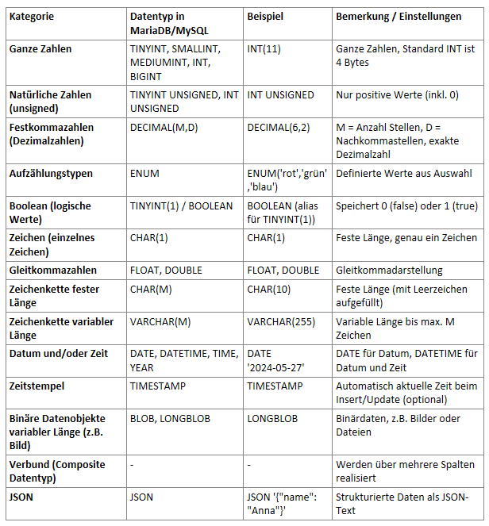
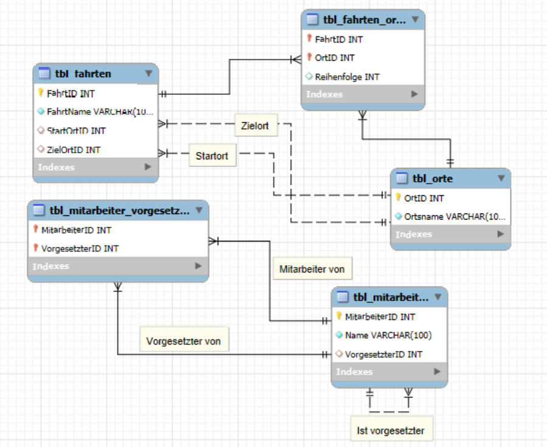

# Learningjournal_M164

# Day 3 - 27.05.25

## Activities
Today, I started by independently reading through the materials available on GitLab. The main topics I focused on were a repetition of data types from the M161 course, recursion, and Data Query Language (DQL). To deepen my understanding, I also completed a practical exercise by working on a tour planner application. This exercise helped me apply the theoretical concepts in a real-world context and reinforced my knowledge of database queries and recursive logic.

## Key Learnings
Revisiting data types and recursion strengthened my understanding of core programming and database principles, which are essential for efficient data handling and problem-solving.

Working through the tour planner exercise allowed me to apply Data Query Language skills in a hands-on scenario, improving my ability to write effective queries and manipulate data within a database.

I also managed to get to know the Tools and techniques better, which will help me in next weeks exam.

## Theory

### Data Types in MySQL/MariaDB

Data types define the kind of data that can be stored in a table column. Choosing the correct data type ensures efficient storage, accurate processing, and integrity of data.

   
### Recursion and other Realtionships

Recursion is a programming technique where a function calls itself to solve smaller instances of a problem until reaching a base case. It is useful in hierarchical data processing (e.g., organizational charts, folder structures).

In SQL, recursive Common Table Expressions (CTEs) enable recursive queries to traverse hierarchical data, also deleting whole tables.

In this example, I updated the touring planner using recursion on the employee. An employee can be a superior but doesn't have to be (can be Null).

I also added multiple relationships regarding the tables tbl_fahrten and tbl_orte. Startlocation and Endlocation are not dependent on each other.

In the simple hierarchy, a self-referencing foreign key was added to the employee table to represent each employee’s single supervisor, allowing a strict hierarchical structure within the same table.

### Data Query Language (DQL)

The primary command is SELECT, which retrieves data from one or more tables.
It supports filtering (WHERE), sorting (ORDER BY), grouping (GROUP BY), and aggregation (SUM(), COUNT(), etc.) and advanced querying requires understanding indexes, joins, and query optimization.